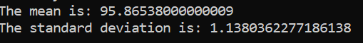
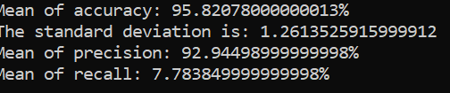

# Machine Learning - Report 
## Computer Science - Section 2
## Eliane Duguay

                       Distributions of Model Accuracy

- Each time I run the classification model I get a different accuracy because the test and training set are selected on a random basis. This causes the computer training to be based on different numbers, thus facing different cases each time.
- When the classification process is ran 1000 times the mean and the standard deviations are:

- The guideline against which we should compare the model is how many times the result is malignant and how many times it is benign.

                        Analysis of Different Error Types
                        
- A false positive is when a patient is diagnose with a illness that he does not really have. A false negative is when a patient does not receive a diagnosis when he should have. 
- What makes recall and precision different is that the precision is the percentage of malignant diagnosis were actually right and recall is the percentage of benign diagnosis that were suppose to be malignant. Basically, the goal is to minimize the percentage of recall as much as possible and maximize the number of precision as much as possible. After 1000 runs of the classification process here are the results: 

